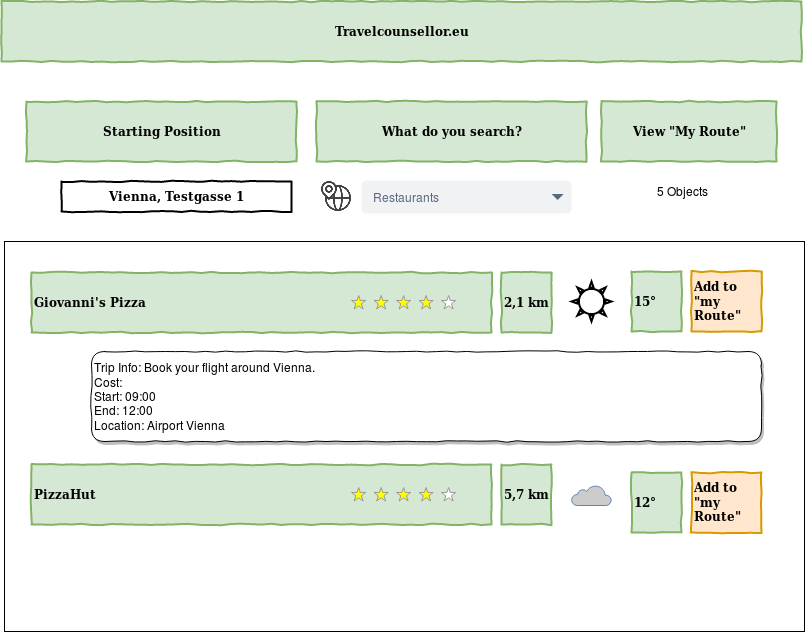

# Plan

- After the first presentation some issues had to be addressed
- We've divided the work into different issues and are working on it individually and as a group

# Basic view and functionnalities

[comment]: <> (include progress description of HTML + CSS frontend Design)

# Basic Weather API interaction

[comment]: <> (Alex TODO: describe progress in a few bullet points)

# Getting Geoposition

[comment]: <> (Michael/Tobias TODO: describe progress in a few bullet points)

[comment]: <> (include progress description of MyPosition)

# Basic Google places API interaction

- We can request and receive details about an selected area
- We order the results in a particular to present the most desirable results at the top
